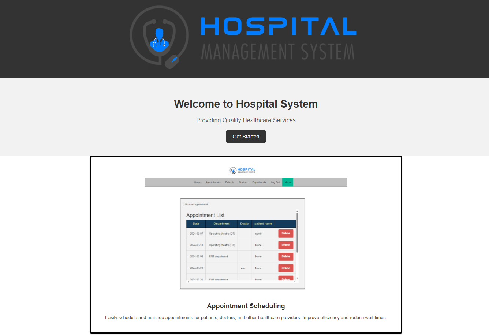

# Hospital Management System

### The Hospital System Project is a comprehensive software solution designed to streamline and optimize various aspects of hospital management.
### It aims to improve the efficiency of administrative tasks, enhance patient care, and facilitate seamless communication between healthcare professionals.

## Installation

### linux:

Installing flask:

    $ pip3 install flask

Installing mysql:

    $ sudo pip3 install mysql
    $ sudo apt-get install python3-mysqldb
    $ sudo apt-get install python3-dev default-libmysqlclient-dev

Installing SQLAlchemy:

    $ pip3 install SQLAlchemy

Installing gunicorn:

    $ pip3 install gunicorn

## Usage:

First clone the repository from Github and switch to the new directory:

    $ git clone https://github.com/MonaaEid/Hospital-Mangement-System
    $ cd Hospital-Mangement-System

Start gunicorn:

    $ sudo systemctl daemon-reload
    $ sudo systemctl enable gunicorn
    $ sudo systemctl start gunicorn
    $ sudo systemctl status gunicorn

Run the application:

    $ gunicorn --bind 0.0.0.0:5000 flaskr.app:app

## Contributing
### Mohamed Nasef                         Mona Eid

